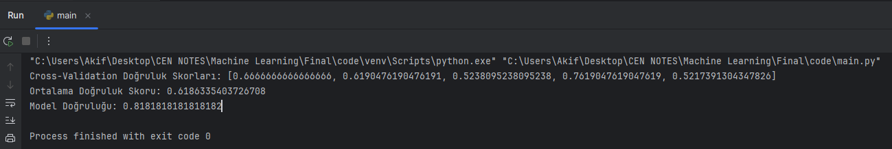

# Predicting the Use of Pirated Publications

## 1. Introduction

### 1.1 Background

* This machine learning project aims to analyze survey data collected from 107 participants to understand their media consumption habits and assess the prevalence of pirated media usage.

### 1.2 Survey Participation
  -  Number of Participants: **107**
  -  Collection Time: **06.01.2024 - 08.01.2024**

### 1.3 Collected Data

* The survey collected information on the following variables:
  -  **Demographic Information:** Gender, Age, Economic Status, Educational Status
  -  **Media Preferences:** Most Preferred Type of Publication
  -  **Usage of Pirated Publications**

## 2. Data Preprocessing

* To prepare the data for machine learning, I employed the following preprocessing steps:
  -  Removed irrelevant features, such as the date of survey completion.
  -  Converted categorical variables into numerical format using one-hot encoding.

* I choose One-Hot encoding instead of Label/Numeric encoding.

* KNN is based on distance calculation so using numeric encoding may interpret model in different way leading unexpected results, so One-Hot encoding might be the best choice in our given encoding techniques.

* One-hot encoding works for most of the cases unless and until we don't have too many features and not running out of memory.

## 3. Model Training

* I utilized the k-Nearest Neighbors (KNN) classification algorithm for predicting the use of pirated publications. The dataset was split into training and testing sets, and the model was trained using the training data.

* The number of **k** neighbors was set to **3** for building the model using KNeighborsClassifier.

* **80%** of the dataset was used for **training** and **20%** for **testing**. The model was trained on the training data and then evaluated with the data from the test set.

## 4. Model Evaluation

* I evaluated the model's performance using various metrics:
  -  **Accuracy Score:** The accuracy score on the test set was found to be **81%.**
  -  **Cross-Validation Score:** The accuracy score on the test set was found to be **61%.**

* To evaluate the model, I used both accuracy score and cross-validation score. I used these two for comparison.

## 5. Cross-Validation

* Cross-validation was employed to evaluate the model's generalizability. I used 5-fold cross-validation and calculated the average accuracy across folds.

* At this stage, a manual cross-validation was applied by me during the modeling process of the project. The dataset was divided into five layers, each layer was used as a test set in turn, and the remaining four layers were used as a training set.

* This process was repeated five times, each time selecting a different layer as the test set to evaluate the performance of the model.

* The accuracy scores obtained provide valuable insights into how the model performs on different datasets.

## 6. Results
  -   Individual Accuracy Score: **81%**
  -   Average Cross-Validation Accuracy: **61%**
    

## 7. Conclusion

* The machine learning model, based on KNN classification, demonstrated promising results in predicting the use of pirated publications. Further analysis and refinement may enhance the model's accuracy and robustness.

* I thought that the difference between the accuracy score and cross validation score values was due to the fact that my dataset was small and randomly separated when separating train and test. I realised that higher accuracy results can be obtained when working with a larger and balanced dataset.
